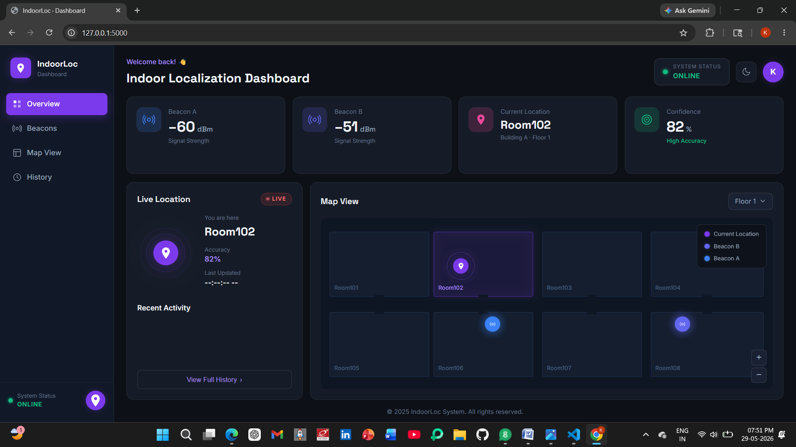
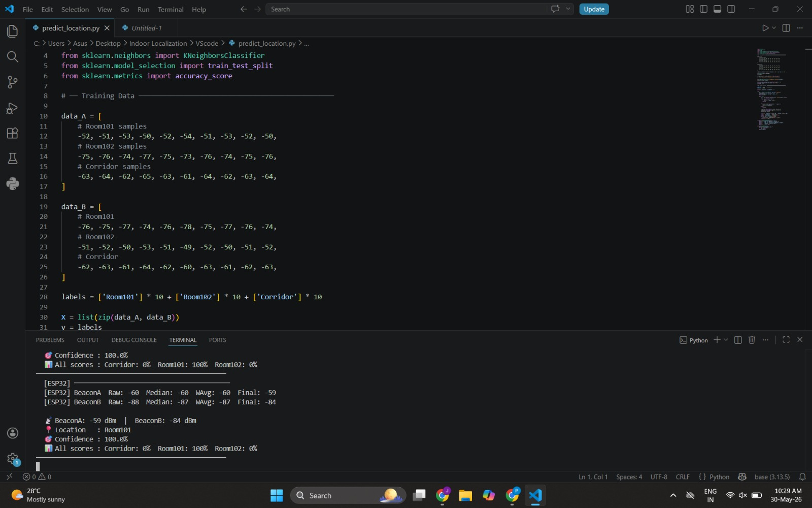
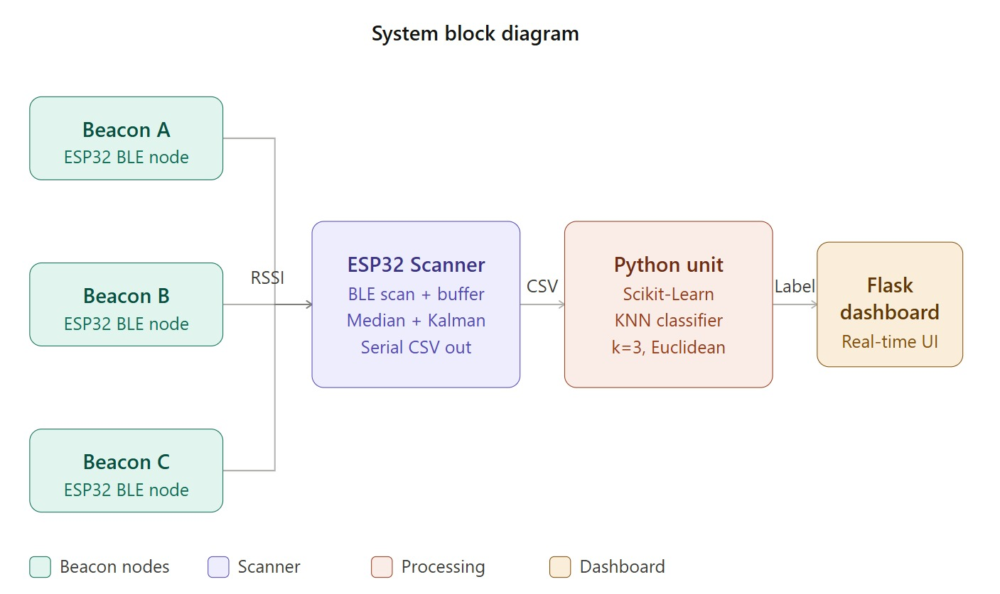
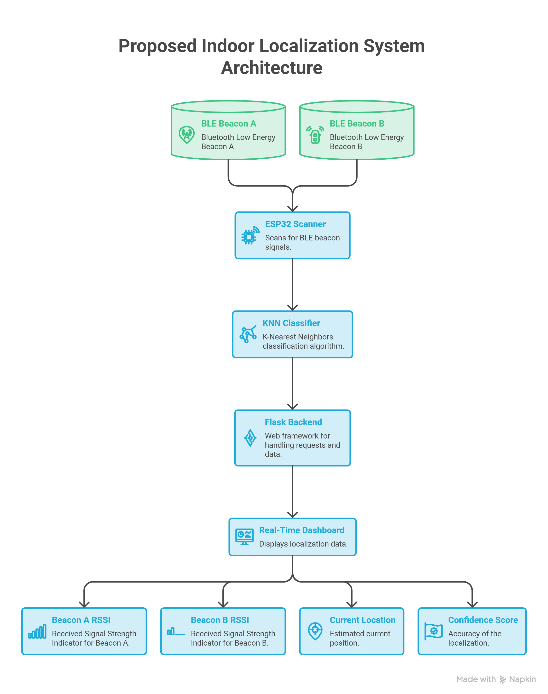
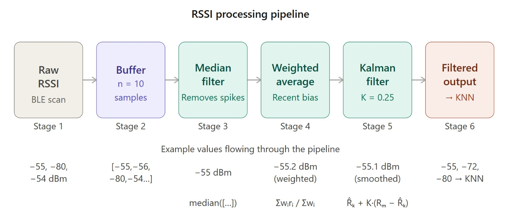

# Indoor Localization Using BLE, RSSI & KNN
Real-time indoor localization using ESP32 BLE beacons, RSSI fingerprinting, signal processing and KNN classification

## Overview
An ESP32-based indoor localization system using BLE beacons and RSSI fingerprinting. 
RSSI signals are processed and classified using K-Nearest Neighbors (KNN) to predict 
the indoor location.

## Objectives
- Collect RSSI data using ESP32 BLE beacons.
- Reduce RSSI fluctuations using signal processing.
- Implement KNN-based location prediction.
- Provide real-time localization visualization.

## Technologies
- ESP32 & BLE
- Embedded C/C++
- Python
- KNN & RSSI Fingerprinting
- Signal Processing
- Flask

## Working
BLE Beacons → ESP32 Scanner → RSSI Collection → Signal Processing → KNN → Location Prediction → Flask Dashboard

## Results
The system successfully performs indoor location prediction using RSSI fingerprinting and KNN.

## Project Structure
- `src/` – ESP32 and Python source code
- `dashboard/` – Flask web dashboard
- `data/` – Localization data
- `docs/` – Project report and presentation
- `images/` – Project images

## Documentation
Refer to the `docs/` folder for the complete project report and presentation.

## Team
- Team of 4 members

## 📸 Project Screenshots

## Future Scope
- Improve localization accuracy.
- Support larger indoor environments.
- Evaluate additional ML algorithms.
